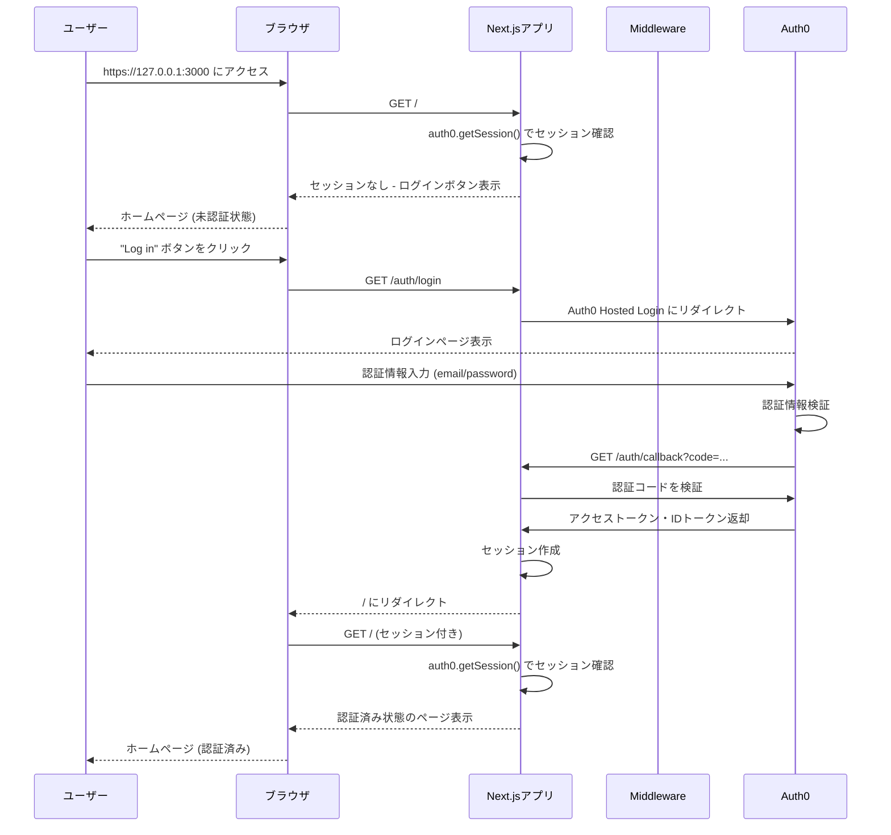
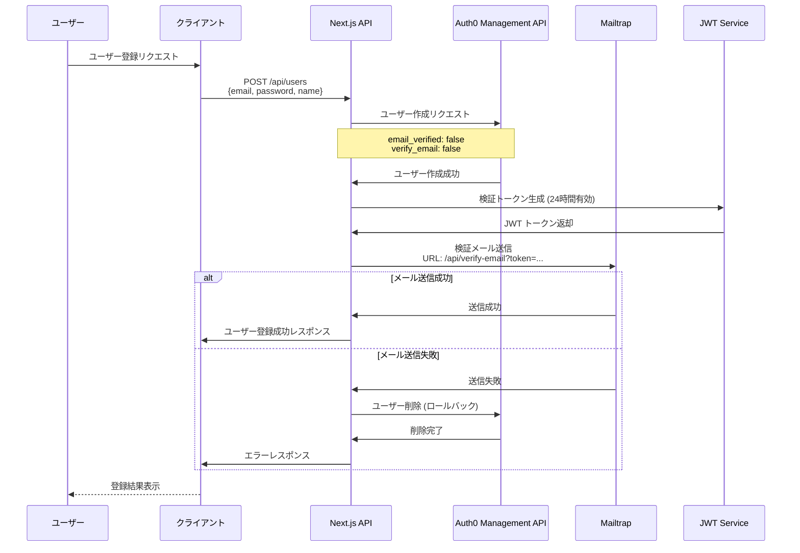
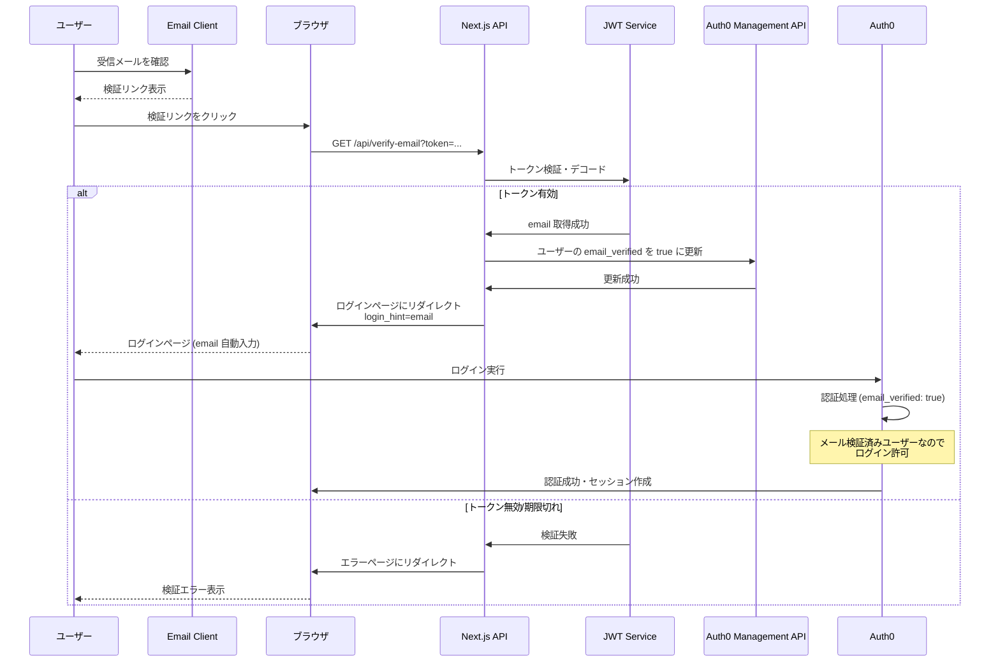
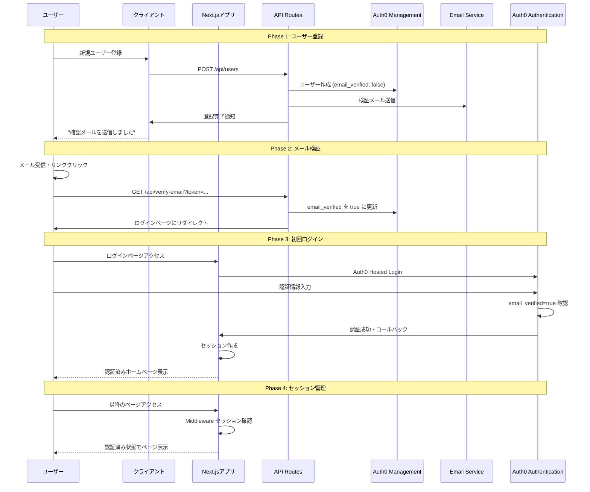

# ユーザー登録フロー - シーケンス図

## 概要

このドキュメントでは、Auth0 PoC プロジェクトにおけるユーザー登録から認証までの完全なフローをシーケンス図で示します。

## 1. 標準的なAuth0ログインフロー



## 2. カスタムユーザー登録フロー



## 3. メール検証フロー



## 4. 完全なユーザー登録〜認証フロー



## フロー詳細説明

### 重要なポイント

1. **HTTPS必須**: 開発環境でも `https://127.0.0.1:3000` を使用
2. **メール検証必須**: ユーザーは email_verified=true になるまでログインできない
3. **JWT有効期限**: 検証トークンは24時間で無効化
4. **ロールバック機能**: メール送信失敗時はAuth0からユーザーを削除
5. **セッション管理**: Auth0 SDK が自動的にセッション Cookie を管理

### 環境変数設定

```env
# Auth0 基本設定
AUTH0_DOMAIN=your-domain.auth0.com
AUTH0_CLIENT_ID=your-client-id
AUTH0_CLIENT_SECRET=your-client-secret
AUTH0_SECRET=your-32-char-secret
APP_BASE_URL=https://127.0.0.1:3000

# Management API
AUTH0_MANAGEMENT_CLIENT_ID=mgmt-client-id
AUTH0_MANAGEMENT_CLIENT_SECRET=mgmt-client-secret
AUTH0_MANAGEMENT_AUDIENCE=https://your-domain.auth0.com/api/v2/

# メール設定
MAILTRAP_API_KEY=your-mailtrap-key
EMAIL_VERIFY_URL=https://127.0.0.1:3000/api/verify-email
JWT_SECRET=your-jwt-secret
```

### セキュリティ考慮事項

- JWT トークンは24時間で自動失効
- すべての機密情報は環境変数で管理
- HTTPS 強制でセキュアな通信を保証
- Auth0 のセキュリティ機能を最大限活用
- メール検証完了まで認証を許可しない